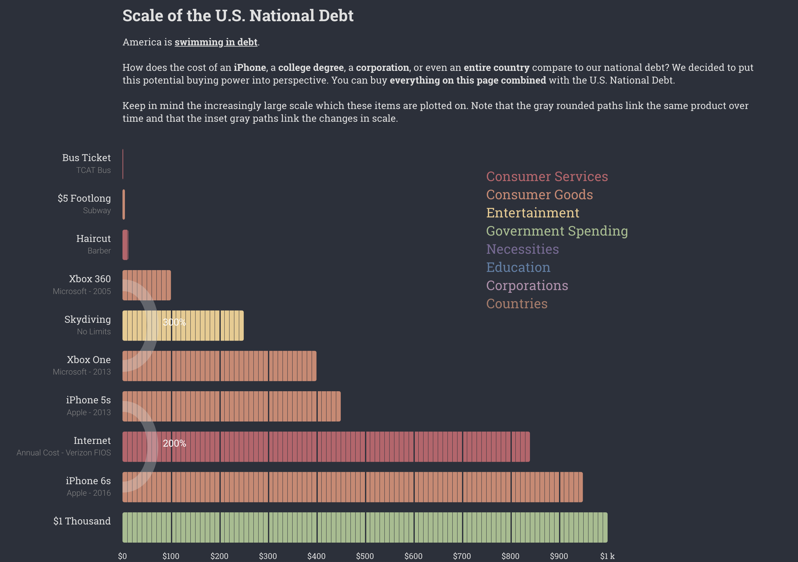

# Debt

Scale of the U.S. National Debt in 2016

### Overview 
Our data came from all parts of the web – all of the sources for every numerical value used to render our graphs are available in the CSV document that we have zipped and submitted. We have a modal, found at the bottom of our visualization, which contains each item’s name, the item’s price and its corresponding source for which the price of the item was listed.
Data for mundane objects and services as well as extraordinary, extraorbitant luxury items were collected in order to compare and contrast the wide differences in cost. The costs of the items would start on the order of several dollars, up until extraorbitant trillions of dollars.

We chose an equal distribution of items within every numerical denomination (in this case, powers of 10). After having a wide variety of data we then began categorizing our data into categories. The following are a subset of categories that were ultimately chosen to represent our data. These categories are services, consumer goods, entertainment, government spending, education, corporations, countries.

We gathered more information than we needed, in order to have choices on which items and services were more relatable and connected, before being pruned. For particular items/services that have multiple iterations we used a field called linking to connect related data elements.
 
### Visualization
We integrated all of the data onto one seemingly continuous bar graph with each item on the y axis and the price on the x axis. We plotted each item’s price up to certain prespecified threshold (1 Thousand ,1 Million,1 Billion,1 Trillion) in which we then inset the graph’s scaling to the next threshold. Thus for example the first item over 1 thousand will create a new scaling for 1 to 1 million and that item’s bar will be visualized on that scale. We plot the bars for all the data, to show the sheer scale of the national debt we capped the partitioning threshold at 1 Trillion and have multiple bars for the items over 1 Trillion. For example the national debt at 19 Trillion has 19 full width bars going downward.

Our data was plotted on various linear scales-- the intervals and maximum values of these scales increases as the viewer scrolls down the page. To plot this data, we compiled a list of items with their costs, descriptions, categories, themes, and sources. Then, we exported the information into a CSV, which we would parse through and place all data into arrays in order to plot our graphs. We would plot all of our data and translate it, to be more aesthetically pleasing, by adding padding where needed.

First the scaling of the y axis is a linear scale with increments for the index of each item. We decided to not include an explicit y-axis (and ticks) to create a cleaner look as the ticks due to the fact there is no relation of the values from one tick to the other as they are self contained items. Each data entry is still spaced evenly on the invisible vertical axis.
The x-axis which maps the price of the item is also a linear scaling that changes to the next thresholds domain (example first [0,1,000] next is [0,1,000,000]) when the current data’s price supersedes the previous threshold. We opted to remove the actual x-axis and keep the increment values to have a cleaner more continuous look. We decided not to place the numerical cost of the item next to the bar because the number would add clutter; the relative values of the costs on each scale is more important than the exact numerical value. By keeping the values they still have a sense of what each item's relative value is while smoothly transitioning to the next scaling.
We use color to showcase the category of the item with a color coded legend at the very beginning of the visualization.
We used a bezier curve with a color gradient to denote the transition from one scale to the next. This paths would point down from the last item of one scale to the first item in the next scale. We placed explicit dollar amounts as the last and first item of each scale as the clearest placeholder to showcase the significance of the transition in scaling. We wanted to illustrate how relatively negligible the cost of an item from one seemingly large scale became as we included increasingly expensive items.

 We also sliced each bar, partitioning the overall bar into segmented bars coinciding with each tick. This gives a clearer visualization of the value of each item’s price than one continuous bar. Within each segment that is further partitioned into 10 sub parts again. To illustrate this with an example for the $1000 scaling. Each big slice is equal to $100 and each small slice is equal to $10.
 
We drew a cubic bezier curve between related items to show the increase in prices of the related items. For example between iphone 5s and iphone 6s. The numerical percentage increase is placed next to the curve. The bezier curve’s control point is drawn by getting the y coordinate of the inflection point by averaging the y coordinate of the two related bar and the x coordinate is based on a linear scaling function based on the displacement in y position. The width of the bar is also based on a logarithmic scaling function of the percentage change in price. The width was on a logarithmic scaling function because there are certain items that have a huge percentage increase and thus that would cause all other normal percentage increases to have razor thin width other than the huge percentage change. By having it logarithmic scaling it gives reasonable widths to all the curves.

We capped the scaling at 1 trillion so that we can show the sense of scale of the national debt with the wrap around of the bars. By having the bar wrap around in the 1 trillion scale for a few data elements leading up to the national debt it improves the wow factor when you see it.

### Impact 

What we wanted to show with our visualization is more than just the fact that the U.S is in a large amount of debt but to put that comically huge number (19 Trillion) into perspective with data of things people have tied a sense of value too. We want to convince viewers that the debt is not just a huge number but there are tangible and great things that can be done with this money which is our focus on the latter half on social welfare programs and government fundings. Our hope is that by the time the viewer gets down to the bottom of the visualization, they will appreciate the sheer magnitude of the U.S. debt. All of the items previous to the debt get progressively larger, but are still relatable until the prices of the goods become unwieldy. While the general American public is aware of the debt, we wanted to put into perspective for viewers how dire and shocking of an issue this debt has become.
